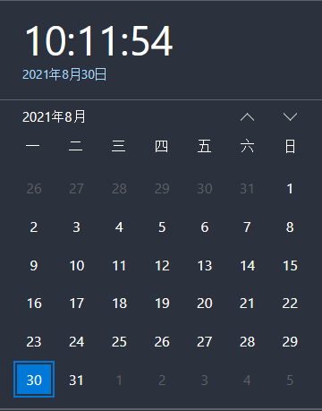
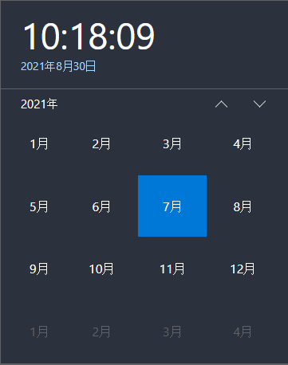
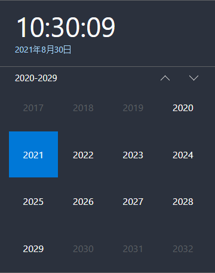
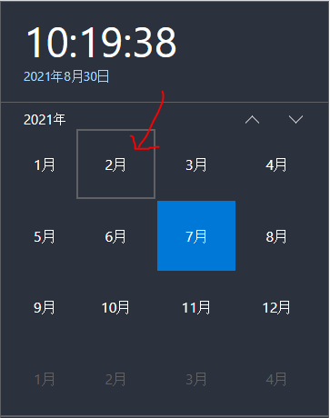
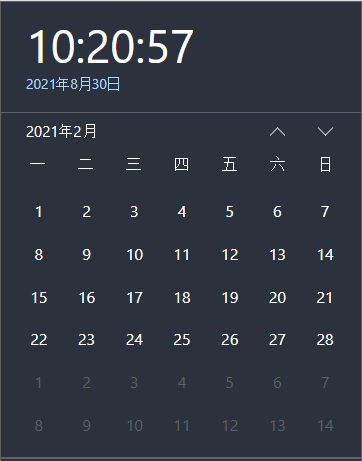
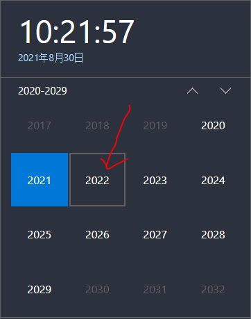
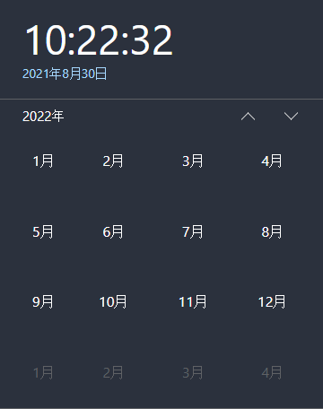
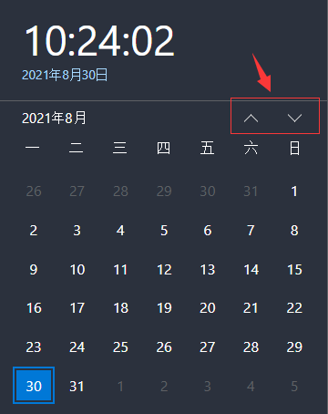
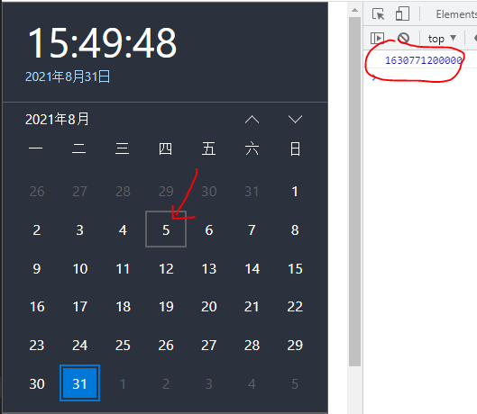

# Demo 讲解

# 模仿 windows10 的系统日历的组件

## 地址：

https://swusj.github.io/Calendar/index.html

## 使用说明：

**引入：**
`import Calendar from "./calendar-module/index.js";`

**创建对象：**
`const myCalendar = new Calendar();`

**方法：**

1. 安装组件,install(选择器名，选项)。isDragable 表示是否可以拖动
   `install(selector,options = {isDragable=true});`
2. 卸载组件 unload(选择器名)
   `unload(selector)`

## 功能说明：

1. 上半部分显示时钟，当天日期（蓝字）；
   下半部分为日历/月历/年历（默认显示日历）

   

2. 点击下半部分的历头为当前展示的 x 历信息，点击一次，下半部分的显示将切换一次：日历->月历->年历，显示年历时再点击历头将无反应

   点击一次

   

   点击两次

   

3. 显示月历时，点击月历中的某一月，切换到显示该月日历。

   点击 2 月

   

   显示 2 月日历

   

4. 显示年历时，点击年历中的某一年，切换到显示该月年月历。

   点击 2022

   

   显示 2022 年月历

   

5. 点击蓝字，回到显示当前所处时间的日历

   

6. 点击上箭头，可以显示上一月/年/十年。点击下箭头，可以显示下一月/年/十年

   

7. 若 install 参数 options 的 isDragable 为 true,鼠标按住顶部即可拖拽日历

8. 点击日历的日期，控制台打印该日期的时间戳

   

# 开发的思路和细节说明

### 问题 1：如何正确显示当前日期 x 历？

1.  首先要有个对象，存当前处于时间（年月日，天数，一号为周几）。const TodayDate (date,month,year,dayNum,dayOfOne)
2.  第二个对象（年月日，天数，一号为周几），存当前显示的时间。let ShowDate (date,month,year,dayNum,dayOfOne)
3.  考虑到需要做成轮播图的效果，都需要准备 3 个 x 历才可以。整体思路都是先生成 3 个 x 历的数据（包括数据以及状态），再根据数据创建 x 历并将其加到页面，再根据数据渲染日历，再添加事件处理函数。

### 问题 2：如何根据不同元素的点击事件切换 x 历？

使用状态机来进行状态管理。

### 问题 3：怎么实现点击按钮后是滚动切换的效果？

借鉴轮播图的思想。可以先显示 3 个月/年/十年的日历，显示的容器 overflow:hidden，position:relative, size 还是是 x 历该有的大小;内里包含一个放了三个 x 历的 div2，按理来说应该是显示容器的三倍（因为有上中下三个月嘛），设置其 position 为 absolute，top 应该等于负一个 x 历的高度； 滚动就可以 transition: top xs 点击的时候，先给轮播图加上 trans,再更改 div2 的 top，此时 transition 生效开始动画，动画完了(用 settimeout)。去掉 trans,再更改 ShowDate。然后重新渲染 div2 的内容(x 历) 因此所有生成 x 历骨架的函数都要一次性生成三个表格。

### 问题 4：如何实现拖拽功能？

日历头部拿块区域，按住其可以就拖拽日历。思路是通过实时更改日历的 left,top。mousedown 时，先将 position 设为 fixed，我们要相当于整个视窗来拖动，然后计算鼠标按下时的位置相对于元素左侧的距离（为了之后根据鼠标位置计算应该在的 top 和 left 做准备）。然后 mousemove 时，根据鼠标位置计算 left，top，更改日历的 left,top。然后 mouseup 时，要清除掉 onmousemove 和 onmouseup。

### 问题 5：如何输出时间戳

获取日历头的 textnode 的 nodevalue 值，然后通过正则匹配来获取年和月。根据点击的元素的 textnode 的 nodevalue 值来获取日历，用前面获得的年、月、日来 new Date，然后输出这个日期对象的 getTime()即可获取时间戳。

#### 1. **显示函数：**

##### **1. 计时器**

- getCurHourMinSec 获取当前时间数据
- createClockStr 格式化时钟文字
- renderClock 渲染时钟的函数
- showClock 用 setInterval 调用 renderClock 实现计时器

##### 2. **蓝字**

- 状态机.init

##### **3. 日历头**

- 状态机.showHead

**4. 显示 x 历**

- 日历 showCalendar： 调用三次 createCalendarData 获取三个月的日历数据 ->createCalendar 根据数据创建日历并将其加到页面->renderCalender 根据数据渲染日历->bindEventListner 添加事件处理函数
- 月历 showMonth： 调用三次 createMonthData 获取三年的月历数据 ->createMonthDOM 根据数据创建月历并将其加到页面->renderMonthYear 根据数据渲染月历->bindEventListner 添加事件处理函数
- 年历 showYear： 调用三次 createYearData 获取三个十年的年历数据 ->后续操作与月历调用函数相同

#### 2. 交互：

##### 1. 所有点击事件全绑定的状态机的方法

- forwordTransition 日历->月历->年历（根据切换后的状态来显示 x 历）
- reverseTransition 年历->月历->日历 （根据切换后的状态和选中的年/月来显示 x 历，如果是日历，会打印时间戳）
- updateHead 不切换状态（根据当前状态来更新 x 历头）
- init 切换状态到日历 （显示当前日期的日历）
- prev 不切换状态 （根据当前状态来实现显示上一月/年/十年的 x 历）
- next 不切换状态 （根据当前状态来实现显示下一月/年/十年的 x 历）

##### 2. 拖拽

- 实现拖拽效果的绑定函数

#### 3. 通用工具：

- isLeapYear 判断是不是闰年的函数
- getDayNum 根据年份和月份获取月份天数的函数
- getDayOfOne 获得某年某月的 1 号 是星期几的函数
- getLastYear 获取上一年日期对象的函数
- getNextYear 获取下一年日期对象的函数
- getLastTenYear 获取前十年日期对象的函数
- getNextTenYear 获取后十年日期对象的函数
- createCss 添加 css link 到页面中的函数
- getTimestamp 根据年、月、日生成时间戳的函数

#### 4. onload：

- calendarOnload 页面初始化要调用的函数(showClock,showToday,showCalendar)

# changelog

## 2021
